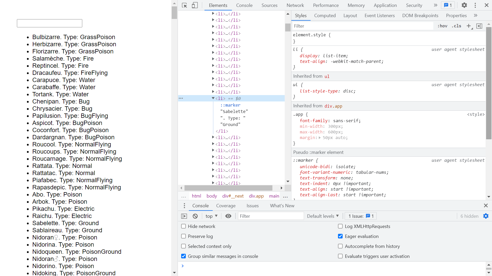

# :zap: Nx Next Express

* Nx monorepo with Express to display API data using Next.js
* Code from the great [Jack Herrington](https://www.youtube.com/channel/UC6vRUjYqDuoUsYsku86Lrsw) with my modifications/additions
* **Note:** to open web links in a new window use: _ctrl+click on link_


## :page_facing_up: Table of contents

* [:zap: Nx Next Express](#zap-nx-next-express)
  * [:page_facing_up: Table of contents](#page_facing_up-table-of-contents)
  * [:books: General info](#books-general-info)
  * [:camera: Screenshots](#camera-screenshots)
  * [:signal_strength: Technologies](#signal_strength-technologies)
  * [:floppy_disk: Setup](#floppy_disk-setup)
  * [:computer: Code Examples](#computer-code-examples)
  * [:cool: Features](#cool-features)
  * [:clipboard: Status & To-do list](#clipboard-status--to-do-list)
  * [:clap: Inspiration](#clap-inspiration)
  * [:file_folder: License](#file_folder-license)
  * [:envelope: Contact](#envelope-contact)

## :books: General info

* **Note:** to be able to generate the next app, @nrwl/next and @nrwl/workspace must have the same version

## :camera: Screenshots



## :signal_strength: Technologies

* [Nx v12](https://nx.dev) build framework used to create project workspace
* [Express v4](https://expressjs.com/) framework
* [Next.js v10](https://nextjs.org/) React framework for production
* [@nrwl/next v12](https://www.npmjs.com/package/@nrwl/next) - v12.3.3 used - **not** latest v12.8.0
* [Tailwind CSS v2](https://tailwindcss.com/) styles

## :floppy_disk: Setup

* `npm i` to install dependencies
* `npm start api` for a frontend dev server on `http://localhost:4200/`
* `npm start next-data` to start app on server `localhost:4200`
* `nx run next-data-e2e:e2e` to run e2e testing on server `localhost:4200`
* `npx nx e2e next-data-e2e --watch` to launch Cypress in "watch mode"

## :wrench: Testing

* `next-data-e2e` Cypress testing added and all tests pass

## :computer: Code Examples

* `index.tsx` template markup to display API data using map method and list

```tsx
return (
    <div className={styles.page}>
      <input value={search} onChange={onSetSearch} />
      <ul>
        {pokemon.map(({ id, name: { french }, type, base: { defense } }) => (
          <li key={id}>
            {french}. Type: {type}. Defence Score: {defense}
          </li>
        ))}
      </ul>
    </div>
  );
```

## :cool: Features

* Monorepo shared libraries etc. makes for tidier code
* Cypress stores test screenshot in `dist\cypress\apps\next-data-e2e\screenshots\app.spec.ts\next-data`

## :clipboard: Status, To-Do List

* Status: Working. Tailwind CSS added.
* To-Do: test Tailwind CSS purge for build, change datafile,

## :clap: Inspiration/General Tools

* [Dreevo: Angular Production - Build, Test & Deploy a Full Stack Application using Nx - Part I](https://www.youtube.com/watch?v=j38ufd8Q86w&t=119s)
* [Juri.dev: Setup Next.js to use Tailwind with Nx](https://juristr.com/blog/2021/06/setup-tailwind-nextjs-and-nx/)
* [Nx documentation](https://nx.dev/angular)
* [Github solution: Next plugin is importing a function from a wrong path #4731](https://github.com/nrwl/nx/issues/4731)

## :file_folder: License

* N/A

## :envelope: Contact

* Repo created by [ABateman](https://github.com/AndrewJBateman), email: gomezbateman@yahoo.com